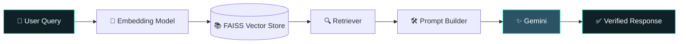
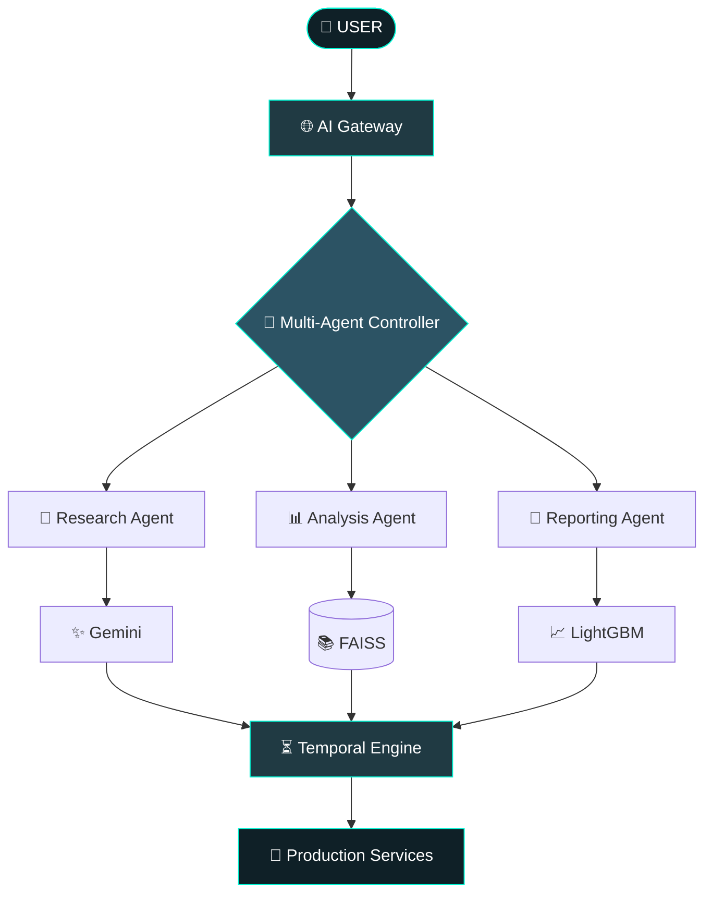
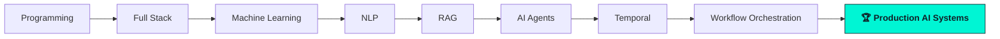

<div align="center">


<br/>


<br/><br/>


[](https://www.linkedin.com/in/burlagadda-ajay-hari-krishna-4a96a1275/)
[](mailto:ajayburlagadda@gmail.com)
[](https://protofolio-by-ajay.vercel.app/)

</div>

---

## ⚡ AI ENGINE STATUS

```yaml
BOOTING AI CORE...
[■■■■■■■■■■■■■■■■■■■■■■■■■■■■■■] 100%

STATUS      : ONLINE
MODE        : PRODUCTION
FOCUS       : Building Reliable, Self-Healing AI Systems
UPTIME      : 99.9%
```

<div align="center">


</div>

---

## 🧠 About Me

```python
class AIEngineer:
    def __init__(self):
        self.name = "Burlagadda Ajay Hari Krishna"
        self.role = "AI Systems Engineer"
        self.focus = [
            "Multi-Agent AI Systems",
            "Retrieval-Augmented Generation (RAG)",
            "Workflow Orchestration with Temporal",
            "Distributed AI Infrastructure",
            "LLM Applications & AI Automation",
        ]
        self.philosophy = "Don't build AI that works. Build AI that keeps working."

    def engineer(self):
        while True:
            self.design(reliable=True)
            self.test(failures=True)
            self.deploy(scale=True)

me = AIEngineer()
me.engineer()
```

I build **production-grade AI systems**, not standalone demos — architected for retries, recovery, observability, and scale.

---

## 🏗 Engineering Philosophy

<div align="center">

| Principle | What It Means |
|:---:|:---|
| 🔁 **Retries** | Systems recover gracefully instead of dying silently |
| 🩺 **Observability** | If it's running, I can see exactly what it's doing |
| 📈 **Scalability** | Built to handle 10x load without a rewrite |
| 🎯 **Reliability First** | A boring system that never breaks beats a flashy one that does |

</div>

---

## 🌌 Featured AI Systems

### 🚀 Market Scout AI — *Production-Grade Market Intelligence Platform*


- 🤖 Multi-Agent Architecture (Research → Analysis → Reporting)
- 📊 LightGBM-powered Forecasting Engine
- 🔎 Real-time AI Research & Analysis Pipeline
- 📄 Automated Professional Report Generation
- 📈 Interactive Live Dashboards
- 📦 Modular, Export-Ready Components

<br clear="right"/>

### 🎓 University Policy RAG — *Retrieval-Augmented Generation Platform*



### ⏳ Temporal Workflow Engineering — *Durable, Enterprise-Grade Orchestration*

- ♻️ Durable execution across long-running workflows
- 🔁 Configurable retry & recovery policies
- 🧩 Fine-grained activity orchestration
- 🏢 Enterprise automation at scale

---

## 🧩 System Architecture



---

## ⚙️ Tech Arsenal

<div align="center">

**Languages**
<br/>


**AI / ML**
<br/>


**Backend, Frontend & Orchestration**
<br/>


**Database & Cloud**
<br/>


</div>

---

## 📈 Engineering Journey



---

## 📊 GitHub Analytics

<div align="center">

<table>
<tr>
<td></td>
<td></td>
</tr>
</table>


</div>

---

## 🐍 Contribution Snake (animated)

> ⚠️ **Setup required — this doesn't work just by pasting the markdown below.**
> 1. Create this exact file in your **profile repo** (the one named `BURLAGADDA-AJAY-HARI-KRISHNA-221FA04286/BURLAGADDA-AJAY-HARI-KRISHNA-221FA04286`) at path `.github/workflows/snake.yml`.
> 2. Go to that repo's **Settings → Actions → General → Workflow permissions** and set it to **"Read and write permissions."**
> 3. Go to the **Actions** tab and manually run the workflow once (`Run workflow` button) — the `output` branch and SVG only get created after a successful run.
> 4. Only after that will the embed below actually render.

```yaml
name: Generate Snake
on:
  schedule:
    - cron: "0 0 * * *"
  workflow_dispatch:
  push:
    branches: [ main ]

jobs:
  generate:
    permissions:
      contents: write
    runs-on: ubuntu-latest
    steps:
      - uses: Platane/snk@v3
        with:
          github_user_name: ${{ github.repository_owner }}
          outputs: |
            dist/github-contribution-grid-snake.svg
            dist/github-contribution-grid-snake-dark.svg?palette=github-dark
      - uses: crazy-max/ghaction-github-pages@v4
        with:
          target_branch: output
          build_dir: dist
        env:
          GITHUB_TOKEN: ${{ secrets.GITHUB_TOKEN }}
```

Then embed it here:

```markdown

```

---

## 🎯 Current Focus

<div align="center">


</div>

---

<div align="center">

### 📌 Philosophy

> **"Don't build AI that works. Build AI that keeps working."**

<br/>

[](https://www.linkedin.com/in/burlagadda-ajay-hari-krishna-4a96a1275/)
[](mailto:ajayburlagadda@gmail.com)
[](https://protofolio-by-ajay.vercel.app/)


</div>
